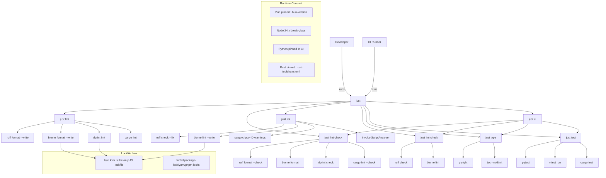
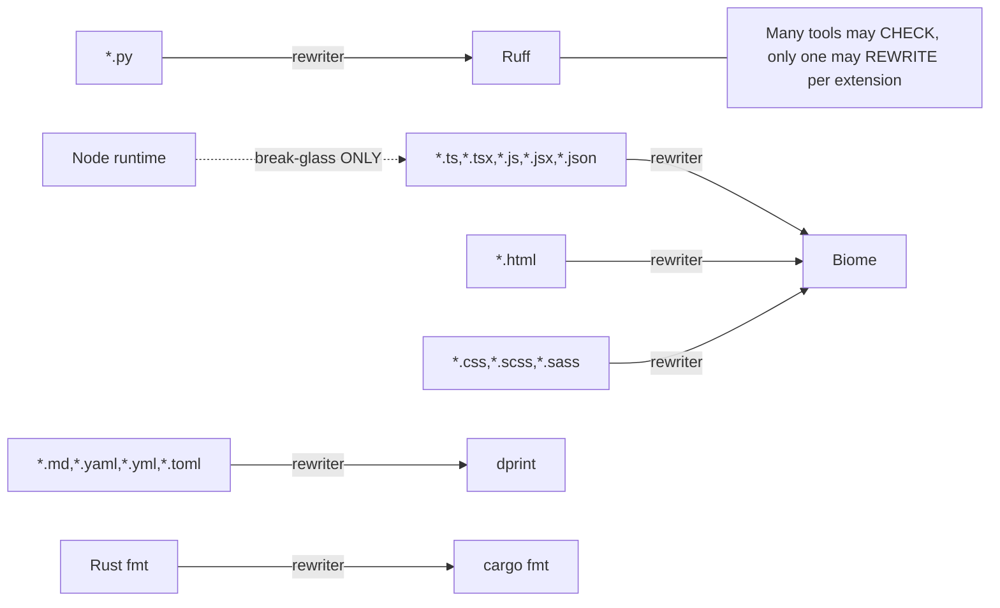

# Governance System Template graph (Mermaid)

## Command surface → tools → guarantees

```mermaid
flowchart TB
  Dev[Developer] -->|runs| Just[just]
  CI[CI Runner] -->|runs| Just

  Just --> FMT[just fmt]
  Just --> FMTCHK[just fmt-check]
  Just --> LINT[just lint]
  Just --> LINTCHK[just lint-check]
  Just --> TYPE[just type]
  Just --> TEST[just test]
  Just --> CICI[just ci]

  CICI --> FMTCHK
  CICI --> LINTCHK
  CICI --> TYPE
  CICI --> TEST

  %% Python
  FMT --> PYFMT[ruff format --write]
  FMTCHK --> PYFMTCHK[ruff format --check]
  LINT --> PYLINT[ruff check --fix]
  LINTCHK --> PYLINTCHK[ruff check]
  TYPE --> PYTYPE[pyright]
  TEST --> PYTEST[pytest]

  %% Web (Bun canonical)
  FMT --> WEBFMT[biome format --write]
  FMTCHK --> WEBFMTCHK[biome format]
  LINT --> WEBLINT[biome lint --write]
  LINTCHK --> WEBLINTCHK[biome lint]
  TYPE --> WEBTYPE[tsc --noEmit]
  TEST --> WEBTEST[vitest run]

  %% Docs/data
  FMT --> DOCSFMT[dprint fmt]
  FMTCHK --> DOCSFMTCHK[dprint check]

  %% Rust
  FMT --> RSFMT[cargo fmt]
  FMTCHK --> RSFMTCHK[cargo fmt --check]
  LINT --> RSLINT[cargo clippy -D warnings]
  TEST --> RSTEST[cargo test]

  %% PowerShell
  LINT --> PSLINT[Invoke-ScriptAnalyzer]

  subgraph Runtime_Contract[Runtime Contract]
    Bun[Bun pinned: .bun-version]
    Node[Node 24.x break-glass]
    Py[Python pinned in CI]
    Rust[Rust pinned: rust-toolchain.toml]
  end

  subgraph Lockfile_Law[Lockfile Law]
    LOCK[bun.lock is the only JS lockfile]
    FORBID[forbid package-lock/yarn/pnpm locks]
  end

  WEBFMT --> LOCK
  WEBLINT --> LOCK
  DOCSFMT --> LOCK
```

## Ownership map (one rewriter per extension)

```mermaid
flowchart LR
  PY["*.py"] -->|rewriter| Ruff[Ruff]
  JS["*.ts,*.tsx,*.js,*.jsx,*.json"] -->|rewriter| Biome[Biome]
  HTML["*.html"] -->|rewriter| Biome
  CSS["*.css,*.scss,*.sass"] -->|rewriter| Biome
  DOCS["*.md,*.yaml,*.yml,*.toml"] -->|rewriter| Dprint[dprint]
  RUST["Rust fmt"] -->|rewriter| Rustfmt[cargo fmt]

  NodeRuntime[Node runtime] -.->|break-glass ONLY| JS
  Note["Many tools may CHECK, only one may REWRITE per extension"]
  Ruff --- Note
```
